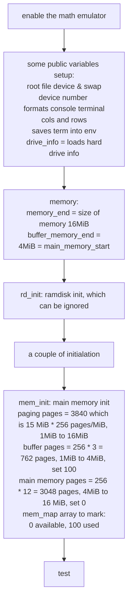

# operating system outline
We are going to draw an outline of the operating system. So we can gain a deeper understanding.
# layer structure
|                  |
|---|
| user application |
| operating system |
| hardware         |

# components of the sample operating system
1. bootsect
2. setup
3. system

# flow chart of part 1: bootsect
1. Copies the whole boot sector (512 bytes) from address 0x7c00 to 0x90000.
2. Jumps to 0x90000 and initializes the segments registers: ds, es, ss and stack pointer sp.
3. Copies the floppy parameter table from 0x78 to 0x9fef4. Patches the sector number to 18. Resets the floppy disk controller.
4. Loads the setup-sectors (4 sectors which is 2KiB) directly after the boot block (0x90200). Setup program is the next part just after the boot loader program. We are going to talk it very shortly. 
5. Gets disk drive parameters, specifically number of sectors/track, and saves it.
6. Loads the system to 0x10000. System module here refers to the the main part of the operating system, which is also running in 32-bit protected mode. Both the boot loader and the setup program are running in 16-bit real mode.
7. Sets root device number and swap device number.
8. Finishes. Jumps to the 0x90200, which is the beginning of program setup.
# main function of part 2: setup
1. Program setup.S reads in information from BIOS and put it in memory from 0x90000.
2. At last of the program it switched to 32-bit protected mode.
# start of part 3: head
1. Loads IDT and GDT.
2. Sets all the segment registers.
3. Checks A20 line.
4. Checks math chip.
5. Setups the page tables and page directory.
6. Jumps to function main. 
# initialation of main program: the main()
1. Loads the swap device number, root device number and drive information into the variable . Formatting the enviroment variables and saves them. Sets size of memory and buffer.
2. Initialization before moving to user mode. Main memroy initilization. Trap, block device, character device, tty and time initilization. Scheduling, hard disk, floppy disk and buffer initiliation. The move_to_user_mode() macro manually creates a return enviroment for the process 0 to live.
3. Then fork_for_process0 firstly creates a process: process init or process 1. 
4. Process 1 never dies unless you shut down the system. It does some initilization then it goes into a big cycle. It creates a process 2, this is actually a concole program. Once this shell dies, the process 1 will create another process. 
## flow chart of main
