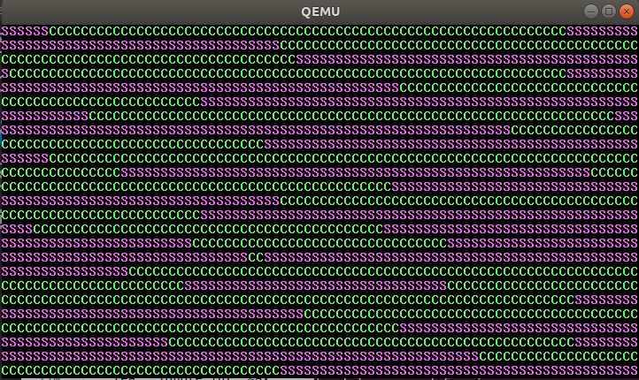

## Boot loader program function
We knew that the legacy BIOS only read in the first 512 bytes from the disk. This very first sector must be ended with 0xAA55 as well. You may already think out a problem, if we continue extending our previous program *ep3.s* to a longer one, it might be more than 512 bytes, then we encounter a problem.

The solution is inside of the first 512 bytes, we write some code to load the next sectors (depends how many sectors our program has) from disk to RAM, then jump to the beginning where we put the second sector, then we can start executing there, problem solved. Even we can not go beyond 1 MiB of the RAM if we are still playing under 16-bit real mode. 

Find the source program *boot0.s* from the source files link.

Inside of the first 512 bytes of the program, we use BIOS function (Int 13/AH=02h) to read the following 16 sectors just after the first sector from the disk into our memory. 

Then from the label **ok_load** we copy the 16 sectors from the location 0x7E00 (512 bytes after 0x7C00) to the beginning of the memory. I planed the let the program jump to 0x0 to run, but as you might have seen, I failed to do so. Because our later program still need the Interrupt Vector Table, which sits in the beginning of the BIOS. Someone might say we have re-define the location of these interrupt procedures, I think so. But I support that would be a terrible task, I do not have any interest in digging deeper on the BIOS system. But I still keep this part **ok_load** for now.

At the end of the first sector, we jump to the beginning of the second sector. Then the whole program from here is very similar to our previous program *ep3*.

Go read, write and run the program, you will see the program alternatively prints **C**s and **S**s:
