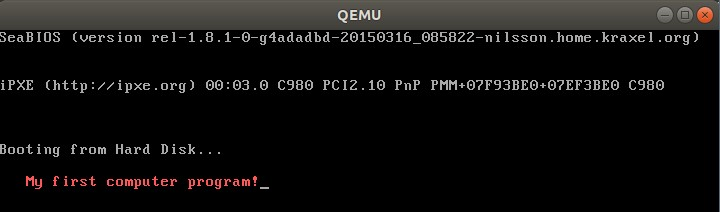

# First Chapter

 A Linux operating system is to be used as the platform for the experiments we are going to do in this book. Please move to the next section if you already have any distribution of Linux installed on your personal computer, it can be running on a virtual machine or alongside with Windows or macOS.

For these who do not currently have a Linux system in hand, or these who are even new to Linux system, Ubuntu desktop is recommended. Ubuntu is a free and open-source Linux distribution. It can be installed either on a virtual machine which is running on your current operating system or alongside with your current operating system. Please refer to [appendix A](../appendix-a-installing-ubuntu-desktop.md) for more information if you encounter some difficulties in installing Ubuntu desktop. It might take several hours if it’s your first time to install a system. Be patient and keep searching the answers whenever something confuses you.

## Write a short program: first

The best way to learn is by doing. Please note I am using Ubuntu 18.04.2 LTS, the commands or operations can be different from these given in this book if you are using any other distribution of Linux. In this case, I suppose you know how to properly change the commands or operations as you are an experienced Linux user. Log into Ubuntu desktop and do the following steps:

```text
.code16
.global _start
_start:
    mov $26, %cx
    mov $0x0903, %dx
    mov $0x000c, %bx
    mov $msg, %bp
    mov $0x1301, %ax
    int $0x10
loop: jmp loop
msg: .ascii "My first computer program!"
.org 510
.word 0xAA55
```

1. **Write the first program.** Find the **Documents** folder and click into it. Create a text file and name it with **first.s**. Open it, copy and paste the above lines into the file then save and close. Congratulations! We have finished the hardest part of the whole chapter. Do not worry at the moment if you have no idea on what you have pasted, all these will be explained in the following sections. Please move to the next chapter, or skip any parts you’ve already known if you understand fully what the code does.
2. **Open a terminal**. Right click on the blank area inside of **Documents** folder and then click Open **Terminal** in the context menu.
3. Install **binutils** tool. Key in `sudo apt install binutils` and press **Enter** button. Input your password when asked. 
4. Assemble the program: **first.s**. Inside of the **terminal**, input the following command and press **Enter** button:`as -o first.o first.s` 
5. Generate the **first.img**. Input or copy and paste the following command and press **Enter** key: `ld -Ttext=0x7c00 -o first.img --oformat=binary first.o` 
6. Install **Qemu** emulator. Key in `sudo apt install Qemu`. Input **Y** and press **Enter** key when asked _“Do you want to continue? \[Y/n\]”_. 
7. Run your program. Input or copy and paste the following command and press **Enter** key: `sudo Qemu-system-x86_64 -cpu max -drive format=raw,file=first.img`
8. We will see the following window if everything has gone well so far. The light red words _**My first computer program!**_ on the screen is what the program does.
9. We have finished first program and had it run. Again we mentioned several terms in the above steps, do not worry these for now, we will see the next sections for the explanations.



## End of this page

