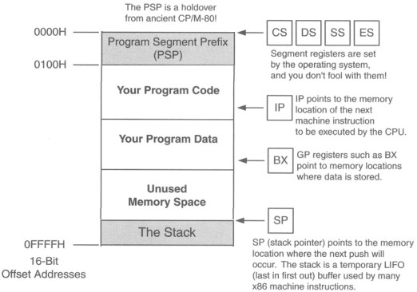
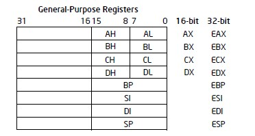

# Part 2 Multi-task Program in Protect Mode

## Memory map, stack & segment, video colour text memory area, function, ASCII code, suffix, x86 assembly language

In this section we are going to introduce some concepts then we start composing another piece of assembly code ep0.s.

### Memory map for "Low" memory \(&lt; 1 MiB \)

We have already introduced that once we power on the computer, the legacy BIOS runs a series of complex programs called Power On Self Test \(or POST\), then the BIOS transfers control to the boot sector. At this time, the first megabyte of memory looks like this :

The first 1024 bytes \(1KiB\) stores the interrupt vector table, which has 256 records, each takes 4 bytes \(32 bits\). Each vector or record is a pointer \(point to the address of a handler, or function or procedure\) that tells the CPU the location where the code associated with the interrupt located. Then the following 256 bytes \(0.25 KiB, 0x400 to 0x4FF\) is a BIOS data area. From 0x0500 to 0x7BFF that’s 29.75 KiB is guaranteed for free use, usually called conventional memory. From 0x7C00 to 0x7DFF there are 512 bytes which is the boot sector. That’s the RAM area where our first program is loaded into. We will still write some code and load them here for a while. There are another 480.5 KiB for conventional use just before the 128 KiB Extended BIOS Data Area \(from 0x80000 to 0x9FFFF\). The EBDA is a variable-sized memory area \(on different BIOSes\). It is always immediately below 0xA0000 in memory if it exists. Also, it is guaranteed to be at most 128 KiB in size. The next 384 KiB is is reserved for graphics video data, ROM data and some other BIOS data. Inside of this part, there are 32 KiB for Colour Text Video Memory. We write the character code and its attributes into this memory area, then these will be displayed on the screen. We will learn how to do this in next section. We do not discuss the memory area above 1 MiB in this section.

### Real mode, memory addressing and high memory Area

Real Mode: Real Mode is a simplistic 16-bit mode that is present on all x86 processors. Real Mode was the first x86 mode design and was used by many early operating systems before the birth of Protected Mode. For compatibility purposes, all x86 processors begin execution in Real Mode. We will play for a while under this real mode until we switch from Real mode to Protected Mode for whose detail will be explained more later. Memory Addressing: You may already have a question why we only list the first megabyte when we discuss the memory map. That’s because we only can access about 1 MiB memory in Real mode. Firstly to see, if we only have 16 bits to store the address of the memory, these 16 bits area stored in a register called IP, see below figure. How many bytes of memory can be addressed? That’s 216=65,536 bytes which is 64 KiB. If we use another register, also 16 bits, stored in a register called CS, then every time we calculate the address we use 16 times the CS then plus the IP to get the physical address. To be simple, we actually can address 220= 1,048,576 bytes which is 1 MiB. Usually we call CS: IP the logical address, the address calculated using CS times 16 +IP the physical address. The address space in Real mode segmented model runs from 0x00000 to 0xFFFFF.

High memory Area: Someone might argue that we can get address more than 0xFFFF, e.g., when CS=0xFFFF, IP=0xFFFF. We have to use the 21st address line to access any memory larger than 0xFFFFF. If we set segment register to a value of 0xFFFF, it points to an address that is 16 bytes below 1 MB. If we then use that segment register as a base, with an offset of 0x10 to 0xFFFF, we can access physical memory addresses from 0x100000 to 0x10FFEF. This \(almost 64 KiB\) area above 1 MiB is usually called the "High Memory Area" in Real Mode. Note that we have to have the A20 \(the 21st\) address line activated for this to work. We do not discuss more about A20 here. For now we are comfortable to limit our discussion on the 1 MiB address space in Real mode.

### Stack & segment registers

All x86 segment registers are 16 bits in size, irrespective of the CPU: • CS, code segment. Machine instructions exist at some offset into a code segment. The segment address of the code segment of the currently executing instruction is contained in CS. • DS, data segment. Variables and other data exist at some offset into a data segment. There may be many data segments, but the CPU may only use one at a time, by placing the segment address of that segment in register DS. • SS, stack segment. The stack is a very important component of the CPU used for temporary storage of data and addresses. Therefore, the stack has a segment address, which is contained in register SS. • ES, extra segment. The extra segment is exactly that: a spare segment that may be used for specifying a location in memory. • FS and GS are clones of ES, the extra segment. FS and GS both are just additional segments, no specialty here. Names FS and GS come from the fact that they were created after ES: E, F, G. They exist only in the 386 and later x86 CPUs. Extra segments ES, FS, and GS can be used for both data or code. 5

### Real mode Flat model diagram

• The segment registers are all set to point to the beginning of the 64 KiB block of memory. • The operating system sets segment registers when it loads the program. • All segment registers point to that same place. • Physical segment assignments never change as long as the program is running. The segment registers are still functioning, but no work with segments is required.

### Real mode segmented model5

• Real mode segmented model was mainstream programming model throughout the MS-DOS era. • Used when Windows 9x machine is booted into MS-DOS mode. • Good choice to write code to run under MS-DOS. • Program has access to 1MB of memory. • The CPU handles transformations of segment:offset combinations into a full 20-bit address. • CS always points to the current code segment • The next instruction to be executed is pointed to by the CS:IP register pair. • Machine instructions called jumps can change CS to another code segment if necessary. • The program can span several code segments. • There is no direct CS manipulation to change from one code segment to another: when a jump instruction needs to take execution into a different code segment, it changes CS value for you. • There is only one stack segment for any single program. • A program has potential to destroy portions of memory that does not belong to its process. Careless use of segment registers will cause the operating system to crash.

### Video colour text memory area

We actually print a string in our very first program first. We understand as long as we put the address of the string and the attributes like colour attributes and then raise the interrupt, the CPU will call BIOS procedure to print the string onto the string.

There are generally two ways to access VGA text-mode for an application: through the Video BIOS interface \(which we have done in chapter 1\) or by directly accessing video RAM and I/O ports. The latter method is considerably faster, and allows quick reading of the text buffer, for which reason it is preferred for advanced TUI programs. The VGA text buffer is located at physical memory address 0xB8000. Since this is usually used by 16-bit x86 processes operating in real-mode, it is the first half of memory segment 0xB800. The text buffer data can be read and written, and bitwise operations can be applied. A part of text buffer memory above the scope of the current mode is accessible, but is not shown.8 Each screen character is actually represented by two bytes aligned as a 16-bit word accessible by the CPU in a single operation. The lower, or character, byte is the actual code point for the current character set, and the higher, or attribute, byte is a bit field used to select various video attributes such as colour, blinking, character set, and so forth.8

### x86 general purpose registers, x86 instruction reference and RFLAGS registers

We’ve briefly discussed the segment registers. Now we introduce the general purpose registers before we do more code. x86-64 has sixteen \(almost\) general purpose 64-bit integer registers. The above illustration shows the eight 32-bit general purpose register and their alternate names. In 64-bit mode there are another eight general purpose registers R8~R15, while we do not talk about these at the moment. Although the main registers \(with the exception of the instruction pointer\) are "general-purpose" in the 32-bit and 64-bit versions of the instruction set and can be used for anything, it was originally envisioned that they be used for the following purposes: • AL/AH/AX/EAX/RAX: Accumulator • BL/BH/BX/EBX/RBX: Base index \(for use with arrays\) • CL/CH/CX/ECX/RCX: Counter \(for use with loops and strings\) • DL/DH/DX/EDX/RDX: Extend the precision of the accumulator \(e.g. combine 32-bit EAX and EDX for 64-bit integer operations in 32-bit code\) • SI/ESI/RSI: Source index for string operations. • DI/EDI/RDI: Destination index for string operations. • SP/ESP/RSP: Stack pointer for top address of the stack. • BP/EBP/RBP: Stack base pointer for holding the address of the current stack frame. IP/EIP/RIP: Instruction pointer. Holds the program counter, the address of next instruction. The FLAGS register is the status register in Intel x86 microprocessors that contains the current state of the processor. This register is 16 bits wide. Its successors, the EFLAGS and RFLAGS registers, are 32 bits and 64 bits wide, respectively. The wider registers retain compatibility with their smaller predecessors.

## End

