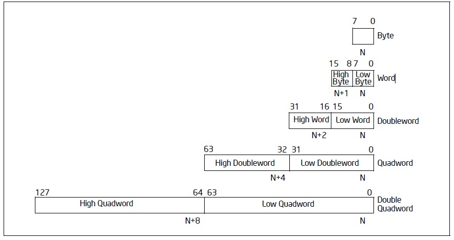
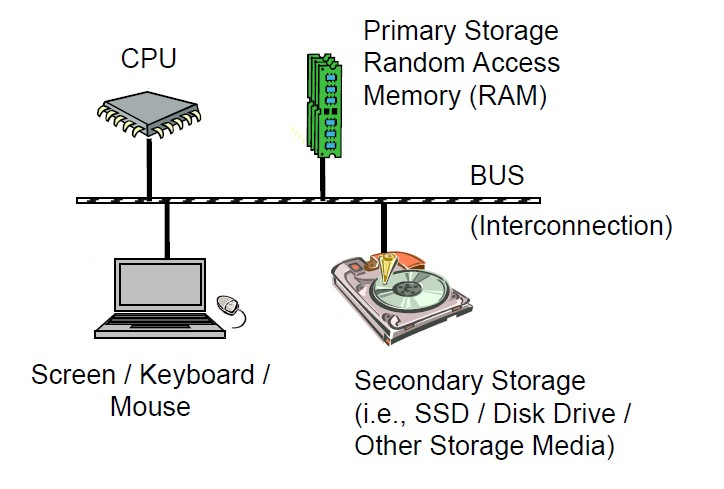
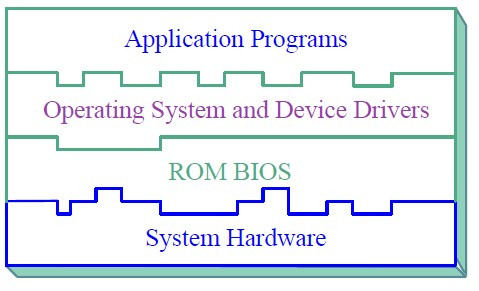

# Part 1: Our First Assembly Program

 A Linux operating system is to be used as the platform for the experiments we are going to do in this book. Please move to the next section if you already have any distribution of Linux installed on your personal computer, it can be running on a virtual machine or alongside with Windows or macOS.

For these who do not currently have a Linux system in hand, or these who are even new to Linux system, Ubuntu desktop is recommended. Ubuntu is a free and open-source Linux distribution. It can be installed either on a virtual machine which is running on your current operating system or alongside with your current operating system. Please refer to [appendix A](appendix.md) for more information if you encounter some difficulties in installing Ubuntu desktop. It might take several hours if it’s your first time to install a system. Be patient and keep searching the answers whenever something confuses you.

## Write a Short Program: first

The best way to learn is by doing. Please note I am using Ubuntu 18.04.2 LTS, the commands or operations can be different from these given in this book if you are using any other distribution of Linux. In this case, I suppose you know how to properly change the commands or operations as you are an experienced Linux user. Log into Ubuntu desktop and do the following steps:

```text
.code16
.global _start
_start:
    mov $26, %cx
    mov $0x0903, %dx
    mov $0x000c, %bx
    mov $msg, %bp
    mov $0x1301, %ax
    int $0x10
loop: jmp loop
msg: .ascii "My first computer program!"
.org 510
.word 0xAA55
```

1. **Write the first program.** Find the **Documents** folder and click into it. Create a text file and name it with **first.s**. Open it, copy and paste the above lines into the file then save and close. Congratulations! We have finished the hardest part of the whole chapter. Do not worry at the moment if you have no idea on what you have pasted, all these will be explained in the following sections. Please move to the next chapter, or skip any parts you’ve already known if you understand fully what the code does.
2. **Open a terminal**. Right click on the blank area inside of **Documents** folder and then click Open **Terminal** in the context menu.
3. Install **binutils** tool. Key in `sudo apt install binutils` and press **Enter** button. Input your password when asked. 
4. Assemble the program: **first.s**. Inside of the **terminal**, input the following command and press **Enter** button:`as -o first.o first.s` 
5. Generate the **first.img**. Input or copy and paste the following command and press **Enter** key: `ld -Ttext=0x7c00 -o first.img --oformat=binary first.o` 
6. Install **Qemu** emulator. Key in `sudo apt install Qemu`. Input **Y** and press **Enter** key when asked _“Do you want to continue? \[Y/n\]”_. 
7. Run your program. Input or copy and paste the following command and press **Enter** key: `sudo Qemu-system-x86_64 -cpu max -drive format=raw,file=first.img`
8. We will see the following window if everything has gone well so far. The light red words _**My first computer program!**_ on the screen is what the program does.
9. We have finished first program and had it run. Again we mentioned several terms in the above steps, do not worry these for now, we will see the next sections for the explanations.


## Concepts: Terminal, Assembler, Linker and Emulator

We go though some basic concepts before we explain what exactly we have done in the last section.

### Ubuntu desktop environment

New to Linux? Give yourself half an hour to click each icon or button you can find in Ubuntu desktop to see what they are. Refer to the guide below or just search any topic you are interested in if necessary. Ubuntu desktop guide: [https://help.ubuntu.com/stable/ubuntu-help/](https://help.ubuntu.com/stable/ubuntu-help/)

### Terminal and CLI

On Linux desktop, the Terminal is a program where commands are used to interact with computer. Most people are familiar with GUI or graphical user interface. Instead of using mouse heavily to interact with all kinds of GUI items, we will use command-line interface or CLI to talk to computer. In case you are new to CLI, you may want to quickly go through chapter 2~4 of this book _The Linux Command Line_ \([http://linuxcommand.org/tlcl.php](http://linuxcommand.org/tlcl.php)\) written by Willian Shotts. Or search something like the most used 10 Linux commands and play with these commands for an hour. Both CLI and GUI are also called shell which in fact is a user interface for access to an operating system’s services. We call it a shell because it is the outermost layer outside of the most important part of the operating system: the kernel. Feel free to google any of these terms you are interested in while it’s good for now even it’s the first time we have heard any of these. We will have a more concrete understanding with time going on.

### Binutils, as and ld

GNU Binutils are a collection of binary tools. The main ones are as and ld. The GNU assembler, commonly known as GAS or simply as. Assembler is a computer program which assembles assembly language to machine language. Assembly language is a more readable interpretation of a processor’s machine code, allowing easier understanding and programming by human \[2\]. Machine code is a computer program written in machine language instructions that can be executed directly by a computer's central processing unit or CPU. Each instruction causes the CPU to perform a very specific task \[3\]. CPUs can only understand machine code. Machine code is some combination of statuses which only use two symbols: typically, “0” and “1”. The ld is another program, called linker, that takes one or more object files generated by the assembler and combines them into a single executable, library file, or another object file \[4\].

### Qemu emulator

Qemu is a generic and open source machine emulator and virtualizer. We will see we can this emulator is another computer which runs on your host operating system, Ubuntu here. We will write some programs, put these programs into the virtual “hard disk” of this emulator and make the emulator to run our programs. Just like our real PC runs the operating system which sits on the real disk usually.

## Programs explanation: apt, as, ld and Qemu

1. In step 1 of section 1, we composed a text file using assembly language. It’s OK for now if we do not really understand what the code means. We will examine these assembly code in the next sections and chapters. All we need to understand now is we wrote some assembly code and saved it as first.s, we call this file source file as it contains the source code. The suffix s here stands for source file. 
2. In step 2, we opened a terminal window. The window will look like the below picture where jesse and ubuntu will be your user name and computer name. ~ indicate the current user’s home folder which is /home/your\_user\_name. Documents is just a folder under your home folder. We are now under Document folder because we right clicked in the blank area of this folder in the GUI. Believe you already tried to navigate to different folders following some books or web pages which tell the basic Linux commands usage. The place the cursor flashes is where we key in the commands to interact with the computer, just after the $ sign. `yourname@ubuntu:#/Documents$`
3. Advanced package tool or apt is a program that handles the installation and removal of software Ubuntu and related Linux distributions. sudo is short for superuser do, which is a program allows us to run programs with the security privileges of another user, by default the superuser. We use sudo apt install binutils when installing the tool collection binutils. Program as and ld which are part of the binutils will be used to translate the source file first.s to a runnable file or executable.
4. Let’s see the command in step 4 as -o first.o first.s. as is the program name of GNU assembler. Except for ‘--’ any command-line argument that begins with a hyphen \(‘-’\) is an option. The -o in as -o first.o first.s means we want to give the output file which is generated by the assembler the name first.o. Number of options can be zero or many. Anything that is not an option will be treated as a source file, like the first.s here. After the execution of this command, we get an object file first.o which is the input file of the program ld. 
5. In Step 5, the option -Ttext=0x7c00 tells the linker to locate the text section in the output file at the absolute address 0x7c00. 0x7c00 is a magic number, this is where the computer loads the data from the external storage like hard disk or USB flash drive into main memory. I understand this explanation might still confuse you. We will explain this in the following sections. Similarly, -o first.img tells the linker to generate the output file with the name first.img. Option –oformat=binary specifies the binary format for the output object file. Finally after the execution of this command we get the runnable file first.img. With this runnable file first.img, we would like to find a way to run it now.
6. We can image that the Qemu emulator, which has been installed in step 6, is our brand new machine which has exactly the function as the PC you buy from the shopping centre! But it’s not a real machine, it is only an emulator running on your Linux. We imagine it equips with one of the latest Intel or AMD CPUs \(Intel and AMD are the companies who produce CPUs\). The difference is the PC you buy from the shop comes with an operating system, usually Windows. While this machine does not come with any operating system. We will load the first.img file into the Qemu machine. We image the first.img file is equivalent to the files which are located on the hard disk of your real PC. I see this analogy might be not accurate enough from a computer scientist’ view, but I wish this is good enough for us to understand the relationship between the first.img file and the Qemu emulator for now. 
7. The command in Step 7, sudo Qemu-system-x86\_64 -cpu max -drive format=raw,file=first.img, Qemu-sysem-x86\_64 is our brand new computer but without the operating system installed. Option -cpu max is used to enables all features supported by the accelerator in the current host machine. Option -drive format=raw,file=first.img is used to tell Linux to write the first.img into the disk of our brand new computer Qemu and then press the Power on button. Specifying format=raw avoids Qemu detecting the format and believe it’s a trusted format. file=first.img obviously tells Qemu which file to be loaded into the hard disk. You may have noticed the new term x86\_64, also known as x64, x86-64, AMD64 and Intel 64, is the 64-bit version of the x86 instruction set architecture. We have mentioned the smallest unit the CPU can execute is called an instruction. The set of all the instructions the CPU can understand is some kind of abstract model of a computer architecture. Almost all the PC and all kinds of Mac available in the shop in nowadays \(this documents written in 2019\) are using x86\_64 CPUs. Refer to the below link if you are interested in more information on x86\_64 and its family: [https://en.wikipedia.org/wiki/X86](https://en.wikipedia.org/wiki/X86)
8. By now we have explained everything regarding the program and the commands we used so far but the most important part: what does the code in the text file mean. That’s the task for the following sections.

## Concepts: Von neumann Architecture, Bit, Byte & Legacy BIOS

Before we explain the code in the source file first.s line by line, a couple of concepts need to be introduced.

### Von neumann architecture introduction

In 1945, a mathematician and physicist John von Neumann and some other people wrote a report which describes a design architecture for an electronic digital computer with these components: 


i. A processing unit that contains an arithmetic unit and processor registers

ii. A control unit that contains an instruction register and program counter 

iii. Memory that stores data and instructions 

iv. External mass storage 

v. Input and output mechanisms\[5\] 

Item iv correspondences to the disk or USB flash memory. The traditional hard disk which is an electromechanical device that uses magnetic storage to store and retrieve digital information using one or more rigid rapidly rotating disks. This kind of disk has been serviced the computer industry for more than half century. Since 1990s, a new kind of storage device that uses integrated circuit assemblies to store data appears. It is called solid-state drive or SSD or sometimes solid-state disk although they do not have physical disks. SSD is much faster and expensive than the HDD for hard disk drive. Luckily we do not need to understand too much of their working principles. All we need to know both of them can store data persistently even with power off. No matter what kind of information it is, the existing form on the disk is always a series of two kind of status. We use ‘0’ and ‘1’ to indicate these two kinds of status. Thus the information in a disk or USB drive or DVD disc is just a series of ‘0’s and ‘1’s. Can the ‘0’s and ‘1’s represent all kinds of information like music, movie, cartoons, texts, and all kinds of pictures?

### Bit and Byte

Now it’s a great time to introduce the concept of bit. We already know that the unit of information stored on a disk is either ‘1’ or ‘0’, logically we can imagine the data inside of a disk a combination of ‘0’s or ‘1’s. We call each of these smallest information unit a bit. The x86-64 architecture names a set of different data storage sizes as follows:

| Storage | Size \(bits\) | Size \(bytes\) |
| :--- | :--- | :--- |
| Byte | 8-bit | 1 byte |
| Word | 16-bit | 2 bytes |
| Double-word | 32-bit | 4 bytes |
| Quadword | 64-bit | 8 bytes |
| Double Quadword | 128-bit | 16 bytes |

The below figure also gives the definition of Low Byte, High Byte, Low Word, High Word etc..



### Memory is just a pile of boxes

There are two main kinds of memory, volatile and non-volatile in a computer system. Non-volatile memory like ROM is used for storing firmware such as BIOS. We will talk about BIOS shortly. Firmware is a specific class of computer software that provides the low-level control for the device’s specific hardware. All we need to know for now is the BIOS system which is called firmware is stored in ROM, these data in ROM will not lost even when power off. The volatile memory are typically primary storage or main memory is random-access memory or RAM. We can imagine the RAM just like a piles of boxes which can store data. Inside of each box it’s either ‘0’ or ‘1’, each box represent a bit. When the computer system is running, CPU loads data from these boxes, the main memory, into CPU to do the computing. As there are so many boxes the CPU has to find a way to make sure it loads the right boxes, naturally the clever early computer scientists worked out a way: give these boxes an address. The minimum addressable unit of these boxes are 8, which is 8-bit or a byte. For now we can image that the main memory has a tall piles of boxes, each level contains 8 boxes, 1 byte or 8-bit. The lowest level byte comes with an address 0, the second lowest level byte with address 1, the third lowest level byte with address 2, and so on. And again these ‘0’s and ‘1’s in main memory disappear once power off.

### CPU is a black box with lots of registers

The text book tells us there are two main components inside of a CPU, the control unit or processing unit. While for now we can think a CPU is just a black box, which means we do not need to understand how it works in the hardware level for now. All we need to know is it can execute instructions. We can image that a CPU is just like a mini robot. This little robot or just a black box each time reads in an instruction, it does something based on the instruction then next instruction will be fed to it. We already talked the minimum unit of command CPU can understand is an instruction. Each instruction itself is actually a number of ‘0’s and ‘1’s. Where are these instructions stored? On the surface of this little black box, there are many storage boxes, which are called registers. These registers reflect the CPU’s status, store the instructions and all kinds of data. We will use and learn more about the names and function of these registers.

### I/O devices

We briefly talked about the CPU, main memory and disks, to conclude the first overview of the computer architecture, we have a look at the following illustration.



The above illustration summaries well what have discussed so far. All the other devices we have not mentioned like monitor/screen, keyboard and mouse etc., plus the SSD or HDD and other secondary storage media are all call I/O devices. The reason why we put all these except the CPU and main memory/RAM into one category \(the I/O devices\) is the CPU treats all of these devices in a very similar way. The BUS is just like the high ways, that’s where the CPU, main memory, and I/O devices communicate through.

### Binary and hexadecimal numbers

We learned that every kind of information stored in any kind of disks is just a number of ‘0’s and ‘1’s. Now we consider how to represent 0 or the positive integer numbers like 0, 1, 2, 3 etc. using these magic ‘0’s and ‘1’s. Say if we are just given two bits, we have four kinds of different combination of ‘0’s and ‘1’s: 00, 01, 10, 11. It’s very easy to think that we can just use binary values to represent integers. What is the biggest integer a byte can represent? 1111 1111, right? Some one might mistakenly reckon it’s a decimal number, so we use 0b prefix the number to indicate this is a binary number instead of a decimal number. So 0b11111111 is the biggest integer that 8 bits can represent. A bit hard to count the number of ‘1’s? Then hexadecimal numbers are used to make it much clearer, numbers 0-9 and letters a-f \(or A-F\) are used to represent decimal number 0 to15. So 0b1111 equals to 15 in decimal and 0xF in hexadecimal. Prefix 0x is used to indicate a hexadecimal. The biggest number a byte can represent which is 0xFF equals to 15x16+15 which is 255. Feel free to google and learn more about the binary and hexadecimal number until you feel comfortable. But do not worry too much we will have a deeper understanding when we read more or do more coding.

### Legacy BIOS

A ROM BIOS \(Basic Input/Output System\) is a set of programs permanently stored in a ROM \(Read-Only Memory\) chip located on the computer motherboard. These programs micro-manage the hardware devices installed on the computer. When we turn on the computer, the ROM BIOS initializes and tests these devices. The first job of a ROM BIOS is to initialize and configure the computer hardware when we turn on the computer \(system boot\). The BIOS runs a series of complex programs called the Power On Self Test \(POST\), which performs a number of tasks, including: \[8\] i. Test Random Access Memory \(RAM\) ii. Conduct an inventory of the hardware devices installed in the computer iii. Configure hard and floppy disks, keyboard, monitor, and serial and parallel ports iv. Configure other devices installed in the computer such as CD-ROM drives and sound cards v. Initialize computer hardware required for computer features such as Plug and Play and Power Management vi. Run Setup if requested vii. Load and run the Operating System The last task is to load the Operating System code usually from the disk. The executable file first.img is loaded into main memory and executed when the last command “sudo Qemu-system-x86\_64 -cpu max -drive format=raw,file=first.img” is executed.\[8\]



The above illustration explains well the layers for a computer system. ROM BIOS which is also called firmware sits in between the bare hardware and the Operating System. The application programs like a web browser, a word processing program, or a video player mount on the toppest layer.

## Explanation of assembly source file first.s: Directives, instruction, label, interrupt, legacy BIOS attributes

Now let’s go through the assembly code we wrote in section 1. 

1. Line 1 .code16 is a directive which instructs the assembler, GNU as or GAS the one we use here, to generate the object file in 16-bit mode. As by default GAS generates 32-bit or 64-bit code depending on the configuration. The reason why we need 16-bit code is at the time when this program runs the CPU is in 16-bit real mode. All directives have names that begin with a period \(‘.’\) in GAS. These directives are not translated into any machine code but only tell GAS how to organise or translate the code into machine code.
2. The second line code .global is a directive as well. The function of this directive is to make the symbol, which is \_start in this program, visible to linker. Program first.s only has one source file, while for programs which have more than one source file, the .global directive will make symbol is also available to other source files. Back to the third line of the program, \_start indicates the default entry point. Linker later makes the runnable file starts from the first instruction which is just after the symbol \_start.
3. In line 4 mov $26, %cx, where mov is its opcode, $26 and %cx are its two operands. An opcode or operation code can have zero to two operands. 26 with a prefix $ indicates an immediate number 26 in decimal. A register name cx with prefix % indicates the content inside of the register. This instruction tells CPU to move the immediate decimal number 26 into the register %cx, which is a 16-bit register.
4. Similarly line 5 mov $0x0903, %dx moves the data which is a hexadecimal number 0903 to register dx. Line 6 mov $0x000c, %bx moves the data which is a hexadecimal number 000c to register bx.
5. We look at line 11 msg: .ascii “my first computer program”. .ascii which starts with ‘.’ is a directive, it tells the assembler to reserve space for a string or text, which is the following “my first computer program” here. The msg before the colon \(‘:’\) is called a label. With this label we can refer the address where the string is in this case. 
6. Line 7 mov $msg, %bp moves the address for the string of “my first computer program” to register &=%bp. Similarly line 8 mov $0x1301, %ax moves number 0x1301 to register %ax.
7. The int opcode here is an interrupt, which force the CPU stop executing current task and start calling a routine \(we understand a routine or a handler or a function is a just another piece of code stored somewhere else\). For this case, the operands $0x10 which is decimal number 16 is given to CPU then CPU searches a table called interrupt vector table or IVT to find the location of the handler and then execute the code inside of the handler. Once the interrupt handler finishes, the CPU comes back to execute the next instruction which it leaves before the interrupt. The concept of Interrupt is not hard to understand, is it? Actually this kind of interrupt is usually called software interrupt. There are two other kinds of interrupts, one is external interrupt or hardware interrupt, the other one is called internal interrupt or exception interrupt. We will talk these two later.
8. Line 10 loop: jmp loop lets the CPU jumps to the label loop which again let the CPU jump to the same instruction. So it’s a dead cycle which will freeze the monitor, the CPU would keep doing this instruction until we close the emulator.
9. The last two lines are all directives. .org 510 tells the assembler to put the next instruction or data from the 510th byte of the whole executable file. The last line .word 0xAA55 will fill a word which is two bytes at the 510th and 511st byte location of the file. Actually these two numbers are magic numbers. When the BIOS program starts searching any bootable disk, it examine the first 512 bytes of the disk if it finished with 0xAA55, it thinks it’s a bootable disk and then BIOS program copies this 512 bytes into the main memory \(put them byte by byte from the address 0x7c00\) then CPU starts executing the program for the main memory address 0x7c00. In our example, that’s the runnable code generated from our first assembly source file first.s.
10. Now the only problem is why assign register %cx, %dx, %bx, %bp and %ax with numbers or address 26, 0x0903, 0x000c, $msg and 0x1301. In order to understand this, we need to find out the interfaces the legacy BIOS defines. In other words what numbers or parameters we need to assign to the registers before the interrupt instruction. The following web pages give an easy way to check the meanings of these numbers. Legacy BIOS Interrupt Vector Table: [http://www.ctyme.com/intr/int.htm](http://www.ctyme.com/intr/int.htm) Legacy BIOS colours attributes: [https://en.wikipedia.org/wiki/BIOS\_color\_attributes](https://en.wikipedia.org/wiki/BIOS_color_attributes) Spend some time to study the above web pages, then try change the 0x000c to 0x0002 \(will change to green colour\). Re-assemble, re-link and launch the Qemu to run the program to see the colour changes as desired or not. Actually instead of keying in 3 command lines we can connect the three commands with a semicolon\(‘;’\): as -o first.o first.s;ld -Ttext=0x7c00 -o first.img --oformat=binary first.o;sudo Qemu-system-x86\_64 -cpu max -drive format=raw,file=first.img
11. To conclude the codes, we think in this way to explain these assembly lines again. The intension of the program is to write a line “My first computer program” to somewhere on the screen. This explains well why we have line 11. .ascii which is a directive tells the assembler to save the whole string “My first computer program!” to somewhere in the final executable. We image there’s a data section in the final executable, this string is put in that section as part of the executable. .msg which is a label here, this is necessary because we then can reference this label somewhere else in the source file let the assembler know we want to use the string information there. This label is actually an address. We’ve already mentioned the executable will eventually loaded into the memory before the first instruction of the executable loaded into the dedicated register from where the CPU gets instruction and executes. Then we need to tell where on the screen we hope the string can be printed and the length of the string. The two bytes 0x0903 in line 5 tells the computer the place where the string to be printed. The higher byte 09 and lower byte 03 tell the row number and column number where to print the first letter of the string. Feel free to change any of these two numbers and re-run the program to see how these numbers control the position of the string. The lower byte 0x01 in %bx defines the colours. The higher four bits in the lower byte, which is 0 in our original code, defines the background colour of the character. If you have already studies the page I gave you \([https://en.wikipedia.org/wiki/BIOS\_color\_attributes](https://en.wikipedia.org/wiki/BIOS_color_attributes)\), you will find we can define 16 different colours \(as shown in the below table\). In our code, the higher 4 bits in 0x01 is 0, which means the background of the string will be black according to the below table. Feel free to change 0 to any numbers between 1 to F \(F is a hexadecimal number which is 15 in decimal\), re-assemble, re-link, and re-run the program to see the effects. By the way, 4-bit which is also half byte has 16 different \(24=16\) combination of these ‘0’s and ‘1’s. We use these 16 different statuses to represent 16 different colours, clever? I think so. That’s one way how we can understand every kind information \(colours here\) can be represent by these ‘0’s and ‘1’s, as long as we have enough long bits to put these ‘0’s and ‘1’s. Generally, if we are given n bit \(where n is a positive integer\), we can fill these bits with either ‘0’s or ‘1’s into these bit \(boxes\) to represent 2n different status. Get back to the code. The lower 4 bits in 0x01 here is 1 which let the computer print blue colour characters as we have seen. Change the lower 4 bits to a different number to see the effects? 
12. In line 7, the address of the string, which is msg here, is assigned to register %bp. Then we raise an interrupt in line 9 int $0x10, the CPU then stop the current task \(which is our current program first\), move to some code which was already prepared by the BIOS before our program first runs. CPU based on the number which is %0x10 to check a table \(this table actually stored in the first 1024 bytes of the memory\), which pretty similar the way we check this page \([http://www.ctyme.com/intr/int.htm](http://www.ctyme.com/intr/int.htm)\), now follow me to click the number 10 in the above page, then we see another long list. Next step is to check the number in %ax, which is 0x1301 in our program. So we find the link Int 10/AH=13h \(h here indicate 13 is a hexadecimal number\) and click into this link. Read the page we eventually understand fully why we put those numbers into the four registers %ax, %bx, %cx, and %dx. We have to tell clearly the position, the string content, the colour attributes etc., to the interrupt program which is part of the BIOS in order let the service program \(the BIOS program called here\) know what to do. 
13. I suppose we have examined every part of the whole assembly code we wrote in first.s.

## End of this page

