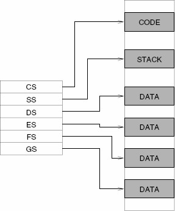
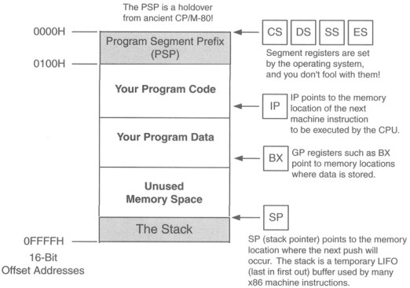
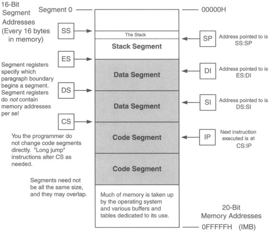
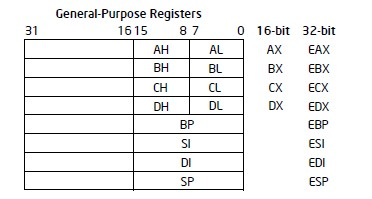
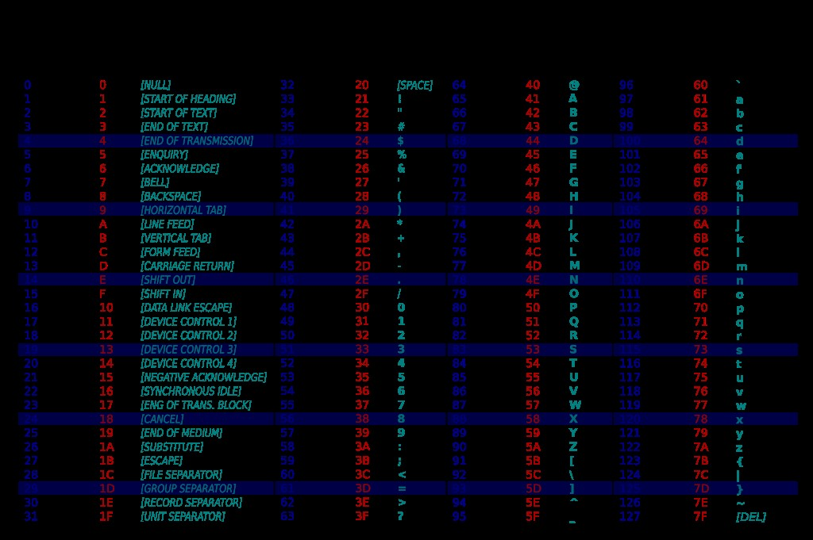
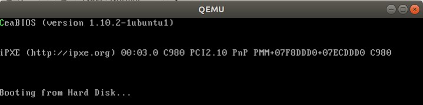
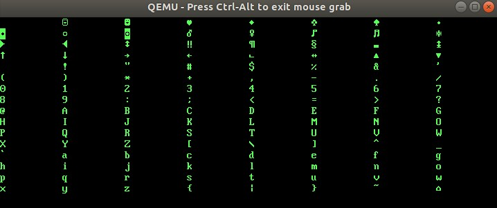
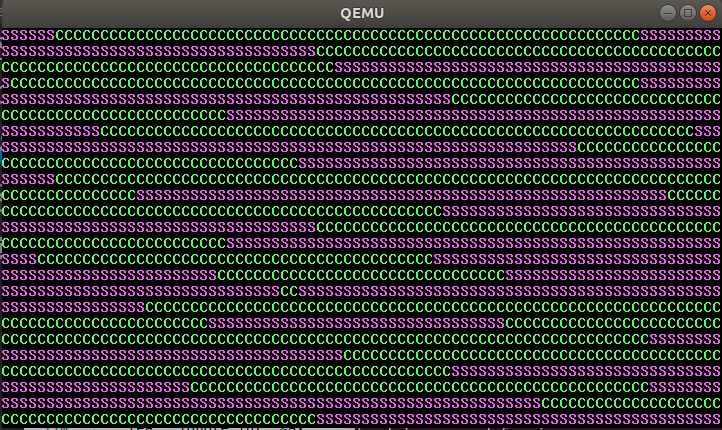

# Part 2: Multi-tasking Program in Protect Mode

## Memory map, stack & segment, video colour text memory area, function, ASCII code, suffix, x86 assembly language

In this section we are going to introduce some concepts then we start composing another piece of assembly code ep0.s.

### Memory map for "Low" memory \(&lt; 1 MiB \)

We have already introduced that once we power on the computer, the legacy BIOS runs a series of complex programs called **Power On Self Test** \(or **POST**\), then the BIOS transfers control to the boot sector. At this time, the first megabyte of memory looks like this :

The first 1024 bytes \(1KiB\) stores the interrupt vector table, which has 256 records, each takes 4 bytes \(32 bits\). Each vector or record is a pointer \(points to the address of a handler, or function or procedure\) that tells the CPU the location where the code associated with the interrupt located. Then the following 256 bytes \(0.25 KiB, 0x400 to 0x4FF\) is a BIOS data area. From 0x0500 to 0x7BFF that 29.75 KiB is guaranteed for free use, usually called conventional memory. From 0x7C00 to 0x7DFF there are 512 bytes which is the boot sector. That’s the RAM area where our first program is loaded into. We will still write some code and load them here for a while. There are another 480.5 KiB for conventional use just before the 128 KiB Extended BIOS Data Area \(from 0x80000 to 0x9FFFF\). The EBDA is a variable-sized memory area \(on different BIOSes\). It is always immediately below 0xA0000 in memory if it exists. Also, it is guaranteed to be at most 128 KiB in size. The next 384 KiB is reserved for graphics video data, ROM data and some other BIOS data. Inside of this part, there are 32 KiB for **Colour Text Video Memory.** We write the character code and its attributes into this memory area, then these will be displayed on the screen. We will learn how to do this in next section. We do not discuss the memory area above 1 MiB in this section.

### Real mode, memory addressing and high memory area

**Real Mode:** Real Mode is a simplistic 16-bit mode that is present on all x86 processors. Real Mode was the first x86 mode design and was used by many early operating systems before the birth of **Protected Mode**. For compatibility purposes, all x86 processors begin execution in Real Mode. We will play for a while under this real mode until we switch from Real mode to Protected Mode for whose detail will be explained more later. 

**Memory Addressing**: You may already have a question why we only list the first megabyte when we discuss the memory map. That’s because we only can access about 1 MiB memory in Real mode. Firstly to see, if we only have 16 bits to store the address of the memory, these 16 bits area stored in a register called IP, see below figure. How many bytes of memory can be addressed? That’s 216=65,536 bytes which is 64 KiB. If we use another register, also 16 bits, stored in a register called CS, then every time we calculate the address we use 16 times the `%CS` then plus the `%IP` to get the physical address. To be simple, we actually can address 2^20 = 1,048,576 bytes which is 1 MiB. Usually we call **%CS: %IP** the logical address, the address calculated using **%CS times 16 + %IP** the physical address. The address space in Real mode segmented model runs from 0x00000 to 0xFFFFF.

![Generating 20-bit physical address in Real Mode \[^1\]](.gitbook/assets/generating-20-bit-physical-address-in-real-mode.jpg)

**High memory Area**: Someone might argue that we can get address more than 0xFFFF, e.g., when CS=0xFFFF, IP=0xFFFF. We have to use the 21st address line to access any memory larger than 0xFFFFF. If we set segment register to a value of 0xFFFF, it points to an address that is 16 bytes below 1 MB. If we then use that segment register as a base, with an offset of 0x10 to 0xFFFF, we can access physical memory addresses from 0x100000 to 0x10FFEF. This \(almost 64 KiB\) area above 1 MiB is usually called the "High Memory Area" in Real Mode. Note that we have to have the A20 \(the 21st\) address line activated for this to work. We do not discuss more about A20 here. For now we are comfortable to limit our discussion on the 1 MiB address space in Real mode.

### Stack & segment registers

All x86 segment registers are 16 bits in size, irrespective of the CPU: 

• CS, code segment. Machine instructions exist at some offset into a code segment. The segment address of the code segment of the currently executing instruction is contained in CS. 

• DS, data segment. Variables and other data exist at some offset into a data segment. There may be many data segments, but the CPU may only use one at a time, by placing the segment address of that segment in register DS. 

• SS, stack segment. The stack is a very important component of the CPU used for temporary storage of data and addresses. Therefore, the stack has a segment address, which is contained in register SS. 

• ES, extra segment. The extra segment is exactly that: a spare segment that may be used for specifying a location in memory. 

• FS and GS are clones of ES, the extra segment. FS and GS both are just additional segments, no specialty here. Names FS and GS come from the fact that they were created after ES: E, F, G. They exist only in the 386 and later x86 CPUs. Extra segments ES, FS, and GS can be used for both data or code. 5



### Real mode Flat model diagram

• The segment registers are all set to point to the beginning of the 64 KiB block of memory. 

• The operating system sets segment registers when it loads the program. • All segment registers point to that same place. 

• Physical segment assignments never change as long as the program is running. The segment registers are still functioning, but no work with segments is required.



### Real mode segmented model5

• Real mode segmented model was mainstream programming model throughout the MS-DOS era. 

• Used when Windows 9x machine is booted into MS-DOS mode. 

• Good choice to write code to run under MS-DOS. 

• Program has access to 1MB of memory. 

• The CPU handles transformations of segment:offset combinations into a full 20-bit address. 

• CS always points to the current code segment 

• The next instruction to be executed is pointed to by the CS:IP register pair. 

• Machine instructions called jumps can change CS to another code segment if necessary. 

• The program can span several code segments. 

• There is no direct CS manipulation to change from one code segment to another: when a jump instruction needs to take execution into a different code segment, it changes CS value for you. 

• There is only one stack segment for any single program. 

• A program has potential to destroy portions of memory that does not belong to its process. Careless use of segment registers will cause the operating system to crash.



### Video colour text memory area

We actually print a string in our very first program first. We understand as long as we put the address of the string and the attributes like colour attributes and then raise the interrupt, the CPU will call BIOS procedure to print the string onto the string.



There are generally two ways to access VGA text-mode for an application: through the Video BIOS interface \(which we have done in chapter 1\) or by directly accessing video RAM and I/O ports. The latter method is considerably faster, and allows quick reading of the text buffer, for which reason it is preferred for advanced TUI programs. The VGA text buffer is located at physical memory address 0xB8000. Since this is usually used by 16-bit x86 processes operating in real-mode, it is the first half of memory segment 0xB800. The text buffer data can be read and written, and bitwise operations can be applied. A part of text buffer memory above the scope of the current mode is accessible, but is not shown.8 Each screen character is actually represented by two bytes aligned as a 16-bit word accessible by the CPU in a single operation. The lower, or character, byte is the actual code point for the current character set, and the higher, or attribute, byte is a bit field used to select various video attributes such as colour, blinking, character set, and so forth.8

### x86 general purpose registers, x86 instruction reference and RFLAGS registers

We’ve briefly discussed the segment registers. Now we introduce the general purpose registers before we do more code. x86-64 has sixteen \(almost\) general purpose 64-bit integer registers. The above illustration shows the eight 32-bit general purpose register and their alternate names. In 64-bit mode there are another eight general purpose registers R8~R15, while we do not talk about these at the moment. Although the main registers \(with the exception of the instruction pointer\) are "general-purpose" in the 32-bit and 64-bit versions of the instruction set and can be used for anything, it was originally envisioned that they be used for the following purposes: 

• AL/AH/AX/EAX/RAX: Accumulator 

• BL/BH/BX/EBX/RBX: Base index \(for use with arrays\) 

• CL/CH/CX/ECX/RCX: Counter \(for use with loops and strings\) 

• DL/DH/DX/EDX/RDX: Extend the precision of the accumulator \(e.g. combine 32-bit EAX and EDX for 64-bit integer operations in 32-bit code\) 

• SI/ESI/RSI: Source index for string operations. 

• DI/EDI/RDI: Destination index for string operations. 

• SP/ESP/RSP: Stack pointer for top address of the stack. 

• BP/EBP/RBP: Stack base pointer for holding the address of the current stack frame. IP/EIP/RIP: Instruction pointer. Holds the program counter, the address of next instruction. The FLAGS register is the status register in Intel x86 microprocessors that contains the current state of the processor. This register is 16 bits wide. Its successors, the EFLAGS and RFLAGS registers, are 32 bits and 64 bits wide, respectively. The wider registers retain compatibility with their smaller predecessors.

For a full list of x86 instruction reference, please refer to x86 and amd64 instruction reference .

### ASCII code

ASCII, abbreviated from American Standard Code for Information Interchange, is a character encoding standard for electronic communication. ASCII codes represent text in computers, telecommunications equipment, and other devices. Most modern character-encoding schemes are based on ASCII, although they support many additional characters.



## Program ep0, write a single character to the video colour text memory

In program ep0, we firstly set the segment registers %ds, %es and %ss to zero, then let %sp equal to 0x7c00, so the stack will grow downwards to the physical memory address 0. Secondly, in the main program we assign the colour attribute and the ASCII code number, assign the address of the character position and the segment address of the colour text memory. At last we call the function “write\_char” to write 2 bytes on to screen. Read the program and try to re-write your own version. Assembly and run the program will get the below output \(the first character was overwritten by the character “C”\).



## Program ep0A, write 128 ASCII code to the video colour text memory

In program ep0A, we will modify program ep0 to make it print the 128 ASCII code onto screen \(33 of the 128 ASCII code are not printable, while different manufacturers extend these 33 code points differently. That’s why we can see some of these non-printable code points still be printed.\). We still call the function write\_char, then we set the %al to number 32 which is code point for space. Then we called write\_char 9 times to print 9 spaces before we write next code point \(from 0 ~ 128\). There will be 8 code points to be printed \(as 80 character width in each row of the screen\). Inside of the write\_char function, code to check whether the current character position on screen added to reset the current character position to be zero when the last position is 1999. Examine the code in ep0A.s and play with it. You will see the below output when you run it.



## Extend program to ep1: add system\_interrupt

In this part, we firstly add a new function system\_interrupt, which for now just call the first function we wrote write\_char and then return \(please note iret used instead of ret\). Then we set the address of the function system\_interrupt to 0x0200. 0x0200 is the handler address of interrupt 0x80. As we already learnt the very first 1KiB in memory stores the Interrupt Vector Table . Lastly in the main part of the program, we use int $0x80 to raise an interrupt after we set the %al and %ah.

### Interrupt Vector Table

In case some of us need to learn more about the Interrupt Vector Table. On the x86 architecture, the Interrupt Vector Table \(IVT\) is a table that specifies the addresses of all the 256 interrupt handlers used in real mode. This website gives us a great idea on more details on the handlers when an interrupt occurs.

Legacy BIOS Interrupt Vector Table: [http://www.ctyme.com/intr/int.htm](http://www.ctyme.com/intr/int.htm)

## ep2: Add two functions task0 and task1

In this part we add two function, task0 to set a green colour, set code point to 67, then it raises an interrupt. This function will let the program keep printing character “C” in green to screen. The second function task1 will keep printing a magenta “S” to screen. I found a little problem at first the program runs, it does not print a whole screen character as supposed. I go back to write\_char function and figure out we need to adjust the value of scn\_pos \(plus 1 each time after we print 1 character\).

## ep3: Programmable interval timer, interrupt request and multi-task

In program ep2, we created two tasks. If we run any of these two tasks, the computer will continue printing character C or S onto screen until we terminate the emulator. Can we switch the tasks from one to another, so forth every certain time interval task0 and task1 are being executed alternatively? Say in the first one tenth second, screen prints C, in the next one tenth second, S is printed. We then think a timer or something like that will be required. The PIT which is short for Programmable interval timer chip, or 8253/8254 chip is something we are looking for. We will firstly brief some concepts before we write and run the program ep3.

### I/O Ports

The x86 architecture separates the address space in two programmatically distinct groups: memory and ports. In ancient history, memory was used as the storage of data where reads and writes would not have side-effects, and ports were used to control external hardware, which needed different timings to work. Which is also why accessing ports is so much slower than accessing memory. Many other common architectures have a unified space, where devices run at the same speed as memory, or where the address space is divided into blocks with separately configurable properties. Modern x86 hardware tends more and more toward the unified space, but still contains the port for legacy reasons.  
An I/O port is usually used as a technical term for a specific address on the x86's IO bus. This bus provides communication with devices in a fixed order and size, and was used as an alternative to memory access. On many other architectures, there is no predefined bus for such communication and all communication with hardware is done via memory-mapped IO. This also increasingly happens on modern x86 hardware. The below map gives a list of the functions of the ports. For now we only need to study more in the following sub sections about the ports 0x40 to 0x47 which is for the Programmable interval timer.

### Programmable interval timer

The PIT chip has three separate frequency dividers \(or 3 separate channels\) that are programmable. The output from PIT channel 0 generates an "IRQ 0", where IRQ which is short for **Interrupt** **ReQuest** . Firstly we send a byte to the control word register to the timer through port 43. A full list of the control word description could be found here Intel 8253 . Then we set the time interval to channel 0 through port 40. After settings these, the timer will raise an interrupt signal to CPU. If the CPU responses to the interrupt, a hander will be invoked to deal with the interrupt. By default, the handler address is 0x08 for legacy BIOS. Once the timer set up, we then prepare a handler timer\_interrupt and write its address to 8th record of the Interrupt Vector Table. Inside of the **timer\_interrupt**, we switch the tasks based on which task is currently running.

## Legacy BIOS: Read from Disk into Memory

### Int 13/AH=02h - DISK - READ SECTOR\(S\) INTO MEMORY

See below for a quick review over this function:


```text
AH = 02h
AL = number of sectors to read (must be nonzero)
CH = low eight bits of cylinder number
CL = sector number 1-63 (bits 0-5)
high two bits of cylinder (bits 6-7, hard disk only)
DH = head number
DL = drive number (bit 7 set for hard disk)
ES:BX -> data buffer

Return:
CF set on error
CF clear if successful
AH = status
AL = number of sectors transferred (only valid if CF set for some
BIOSes)
```

For more information refer to this [page](http://www.ctyme.com/intr/rb-0607.htm).\[^2\]

## Boot loader program function

Source file: _boot0.s_

We knew that the legacy BIOS only read in the first 512 bytes from the disk. This very first sector must be ended with 0xAA55 as well. You may already think out a problem, if we continue extending our previous program _ep3.s_ to a longer one, it might be more than 512 bytes, then we encounter a problem.

The solution is inside of the first 512 bytes, we write some code to load the next sectors \(depends how many sectors our program has\) from disk to RAM, then jump to the beginning where we put the second sector, then we can start executing there, problem solved. Even we can not go beyond 1 MiB of the RAM if we are still playing under 16-bit real mode.

Find the source program _boot0.s_ from the source files link.

Inside of the first 512 bytes of the program, we use BIOS function \(Int 13/AH=02h\) to read the following 16 sectors just after the first sector from the disk into our memory.

Then from the label **ok\_load** we copy the 16 sectors from the location 0x7E00 \(512 bytes after 0x7C00\) to the beginning of the memory. I planed the let the program jump to 0x0 to run, but as you might have seen, I failed to do so. Because our later program still need the Interrupt Vector Table, which sits in the beginning of the BIOS. Someone might say we have re-define the location of these interrupt procedures, I think so. But I support that would be a terrible task, I do not have any interest in digging deeper on the BIOS system. But I still keep this part **ok\_load** for now.

At the end of the first sector, we jump to the beginning of the second sector. Then the whole program from here is very similar to our previous program _ep3_.

Go read, write and run the program, you will see the program alternatively prints **C**s and **S**s:




## Protect Mode, IDT, GDT, control registers, TSS, LDT

## Multitask program in protect mode

### Setup temporary IDT and GDT

### Set control register CRO, move to protect mode

### Establish the IDT

### Establish the GDT

### Reset all segment registers

### Set timer interrupt chip

### Set timer interrupt gate and system call gate

### Prepare the interrupt return scene

### Update all the previous functions

### Game over of this multi-task program


```text
[^1]: http://www.cjump.com/CIS77/ASM/Memory/lecture.html#M77_0020_seg_reg
[^2]. Interrupput Function List: 
http://www.ctyme.com/intr/int.htm↩

```

